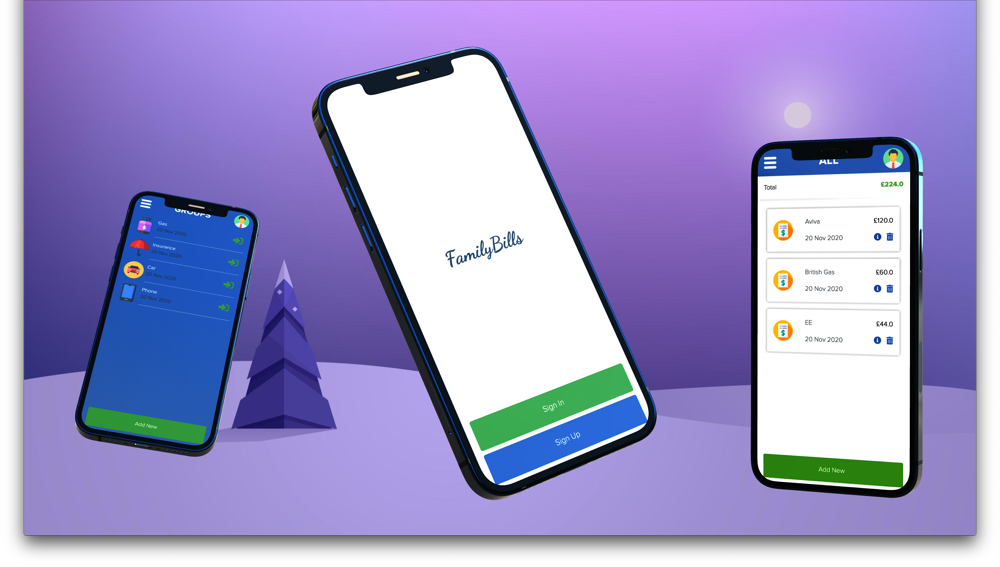
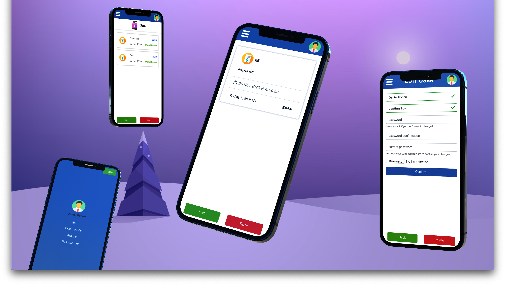
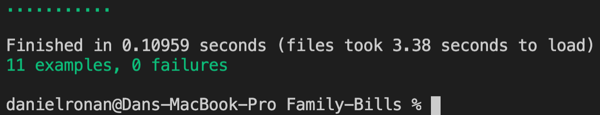

# Family Bills 💰


## Library Directory 📙
 
| Contents        |
| ------------- |
| [Built With](#built-with-🛠) |
| [Features](#features-🎥) |
| [Install](#install-⏳) |
| [Hints](#hints-💡) |
| [Testing](#testing-⚙️) |
| [Authors](#authors) | 
| [License](#license) | 

## Description
> This is my final project for completing the `Ruby on Rails` module. In doing so, I have created a mobile web-application called `Family Bills`.

 


In this app that I have created, you have the ability to track all your bills as a family (or just yourself). The design of the app is provided by [Gregoire Vella](https://www.behance.net/gregoirevella) and you can look at the design [here](https://www.behance.net/gallery/19759151/Snapscan-iOs-design-and-branding?tracking_source=). <br> <br> All the features are displayed [here](#features).

## Built With 🛠
```
- Ruby 2.6.3
- Ruby on Rails 6.0.3
- AWS S3
- PostgreSQL
- Heroku
- Devise
- Bootstrap 4.5.3
- VS Code
- Ruby Gems
```

        

## Live Demo

<a href="https://family--bills.herokuapp.com/"></a>

## Features 🎥

1. `User accounts` - `Sign up` - `Log in` - `Edit account` - `Delete account`
2. `User display picture` <br> <br>
3. <b> <u> Pages </u> </b>
- `User profile`
- `All Bills`
- `External Bills` - `not assigned to a group`
- `All Groups`
- `Group` - `with their allocated bills`
- `Bill` - `full details`
4. `Add a bill` - `with` -> `name` + `amount` + `description`
5. `Allocate to a group`
6. `Create a group` - `with` -> `name` + `group picture`

## Install ⏳

> Follow these steps below to get my Application working

1. - [ ] Open your `Terminal`
2. - [ ] Navigate to the directory where you will like to install the repo by running `cd FOLDER-NAME`
3. - [ ] Run `git clone git@github.com:DcRonan/Family-Bills.git` to download <b>or</b> you can download using `HTTPS` by running `git clone https://github.com/DcRonan/Family-Bills.git` in the terminal
4. - [ ] Run `cd Family-Bills` to enter directory
5. - [ ] Run `bundle install` to install Ruby Gems (<b>hint:</b> Mac users, if not working then run `sudo bundle install`)
6. - [ ] Run `rails db:create` to create a local database
7. - [ ] Run `rails db:migrate` to migrate the database
8. - [ ] Run `http://localhost:3000/` in your browser to start the application

## Testing ⚙️

> I have used [rspec](https://rspec.info/) testing tool to test the code by creating many test cases. Please follow below to test my code

1. - [ ] Open `Terminal` again
2. - [ ] Run `cd Family-Bills` to enter directory
3. - [ ] Run `rspec` to start testing
4. - [ ] All tests will pass ✅



## Authors

### 👨‍💻 Daniel Ronan
[](https://github.com/DcRonan) <br>
[](https://www.linkedin.com/in/danronan10/) <br>
[](mailto:danielconnorronan@gmail.com) <br>
[](https://twitter.com/dc_ronan)

### Acknowledgments 🌟

Design by [Gregoire Vella](https://www.behance.net/gregoirevella) <br> <br>
You can look at the design [here](https://www.behance.net/gallery/19759151/Snapscan-iOs-design-and-branding?tracking_source=)

### 🤝 Contributing

Contributions, issues and feature requests are welcome!

Feel free to check the [issues page](https://github.com/DcRonan/ruby-slack-bot/issues).

### Show your support

Give a ⭐️ if you like this project!

### License


